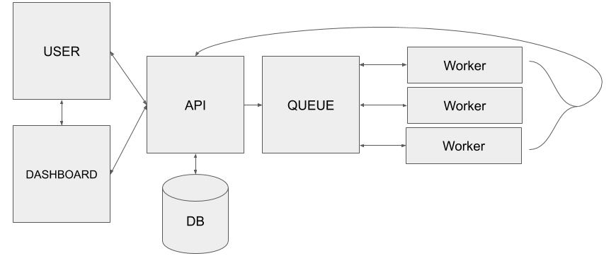

# solarforecastarbiter-core
Core Solar Forecast Arbiter data gathering, validation, processing, and
reporting package.

# Installation

See the [installation](https://solarforecastarbiter-core.readthedocs.io/en/latest/installation.html) instructions in the documentation.

# Documentation

The documentation is hosted at [solarforecastarbiter-core.readthedocs.io](https://solarforecastarbiter-core.readthedocs.io/en/latest/)

# Contributing

We welcome your contributions. Please see our [contributing guide](https://solarforecastarbiter-core.readthedocs.io/en/latest/contributing.html).

# Architecture

The diagram below depicts data flow between components of the Solar
Forecast Arbiter framework. Users of the framework typically interact
with the ``solarforecastarbiter-core`` code through a queue/worker
system maintained by the API. Users may access the API directly or
through the Dashboard. The API queues analyses to be processed by
workers using core code. The workers then send their results to the API
for storage in the database.

Alternatively, users may choose to install the core package on their own
systems and perform their analyses independently of the Dashboard, API,
or database.

