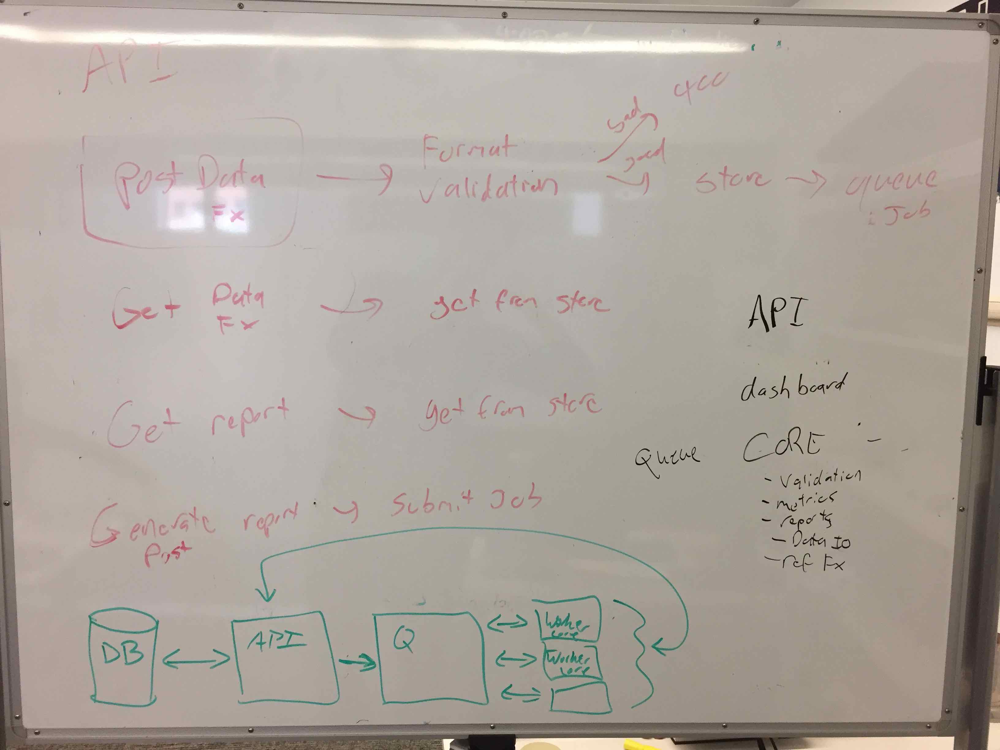

[](https://dev.azure.com/solararbiter/solarforecastarbiter/_build/latest?definitionId=1&branchName=master)
[](https://dev.azure.com/solararbiter/solarforecastarbiter/_build/latest?definitionId=1&branchName=master)
[](https://lgtm.com/projects/g/SolarArbiter/solarforecastarbiter-core/alerts/)
[](https://codecov.io/gh/solararbiter/solarforecastarbiter-core)
[](https://solarforecastarbiter-core.readthedocs.io/en/latest/?badge=latest)
[](https://doi.org/10.5281/zenodo.3473590)

# solarforecastarbiter-core
Core Solar Forecast Arbiter data gathering, validation, processing, and
reporting package.

# Installation
The recommended way to install the package for development is as follows.

First, fork and clone the repository to your machine. From within the
root level of the repository, execute the follow shell commands:

```
conda create -n sfacore python=3.7
conda activate sfacore
pip install -r requirements.txt -r requirements-test.txt
pip install -e .
```

If everything worked, you should be able to run

```
pytest solarforecastarbiter
flake8 solarforecastarbiter
```

# Documentation

The documentation is hosted at [solarforecastarbiter-core.readthedocs.io](https://solarforecastarbiter-core.readthedocs.io/en/latest/)

# Contributing

We welcome your contributions. Please see our [contributing guide](https://solarforecastarbiter-core.readthedocs.io/en/latest/contributing.html).

# Architecture

Sketch of how some SFA components interact, including the core:



All core code will be executed by *workers*. Workers are dispatched by
a *queue*. The workers will use the *API* to get and receive data from the
*database*.

The core's dataio subpackage will provide python wrappers for the API.
The API wrappers will typically return dicts of metadata and Series or
DataFrames of time series data. Most functions in the core subpackages
for validation, metrics, benchmark forecasts, and reports should assume
pandas Series or DataFrame inputs with a valid DatetimeIndex.
